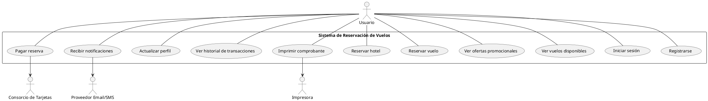

Perfecto, Christian. Empecemos con el **Diagrama de Casos de Uso** para el **Sistema en Línea de Reservación de Vuelos**.

---

### ✅ 1. **Listado de Actores**

| Actor                            | Descripción                                                    |
| -------------------------------- | -------------------------------------------------------------- |
| **Usuario**                      | Persona que usa el sistema para reservar vuelos, hoteles, etc. |
| **Sistema de Reservación**       | Sistema central que ofrece todas las funcionalidades.          |
| **Consorcio de Tarjetas**        | Servicio externo que valida pagos con tarjetas.                |
| **Proveedor de Email/SMS**       | Servicio externo que envía notificaciones.                     |
| **Impresora (actor secundario)** | Sistema de impresión local o remoto del usuario.               |

---

### ✅ 2. **Casos de Uso Principales**

| Caso de Uso                    | Actores Involucrados            | Notas                                               |
| ------------------------------ | ------------------------------- | --------------------------------------------------- |
| Registrarse                    | Usuario                         |                                                     |
| Iniciar sesión                 | Usuario                         |                                                     |
| Ver vuelos disponibles         | Usuario                         |                                                     |
| Reservar vuelo                 | Usuario, Sistema de Reservación |                                                     |
| Ver ofertas promocionales      | Usuario                         |                                                     |
| Reservar hotel                 | Usuario, Sistema de Reservación |                                                     |
| Pagar reserva                  | Usuario, Consorcio de Tarjetas  | Usa validación externa                              |
| Ver historial de transacciones | Usuario                         |                                                     |
| Actualizar perfil              | Usuario                         |                                                     |
| Recibir notificaciones         | Usuario, Proveedor Email/SMS    | El sistema envía notificaciones por email y celular |
| Imprimir comprobante           | Usuario, Impresora              |                                                     |

---

### ✅ 3. **Versión en PlantUML**

Puedes copiar esto en un archivo `.puml` y renderizarlo con PlantUML en tu entorno (por ejemplo, con VSCode + extensión o con `plantuml` desde CLI).

---

### ✅ 4. Explicación Paso a Paso

* **Actor principal**: el *Usuario* interactúa con todos los casos de uso.
* **Actores secundarios**:

  * *Consorcio de Tarjetas* solo se activa cuando el usuario realiza pagos.
  * *Proveedor de Email/SMS* se utiliza para enviar notificaciones de reserva.
  * *Impresora* representa la acción de imprimir un comprobante (actor externo no humano).
* El **sistema de reservación** agrupa todos los casos de uso.

---

¿Deseas que pasemos al **Diagrama de Actividad** para uno de los casos, como "Reservar vuelo", o al **Diagrama de Clases**?
