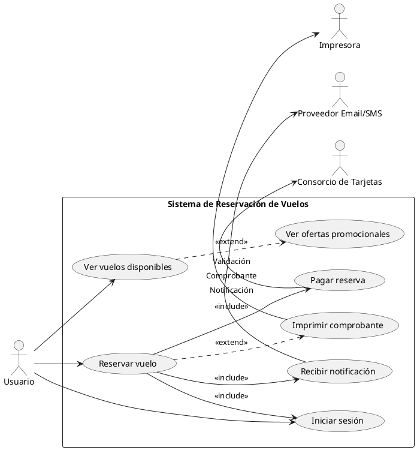

Perfecto, Christian. Vamos a crear una **versión simplificada** del diagrama de casos de uso del Sistema en Línea de Reserva de Vuelos, con:

* **Seis casos de uso**
* Uso de <<include>> y <<extend>>
* Supuestos claros

---

### ✅ Asunciones

1. **El proceso de reservar un vuelo siempre requiere iniciar sesión** → uso de `<<include>>`.
2. **Pagar reserva y recibir notificación son pasos obligatorios dentro de una reserva exitosa** → uso de `<<include>>`.
3. **Ver ofertas promocionales es opcional (extendido desde ver vuelos disponibles)** → uso de `<<extend>>`.
4. **Imprimir comprobante es opcional tras completar una reserva** → `<<extend>>`.

---

### ✅ Casos de Uso Seleccionados (6)

| Código | Caso de uso               | Notas sobre relaciones         |
| ------ | ------------------------- | ------------------------------ |
| UC1    | Iniciar sesión            | Necesario para usar el sistema |
| UC2    | Ver vuelos disponibles    | Principal búsqueda             |
| UC3    | Ver ofertas promocionales | `<<extend>>` desde UC2         |
| UC4    | Reservar vuelo            | `<<include>>` UC1, UC6, UC5    |
| UC5    | Pagar reserva             | `<<include>>` dentro de UC4    |
| UC6    | Recibir notificación      | `<<include>>` dentro de UC4    |
| UC7    | Imprimir comprobante      | `<<extend>>` desde UC4         |

---

### ✅ Diagrama en PlantUML (versión solicitada)

---

### ✅ Explicación visual

* El **usuario** interactúa con solo 3 casos directamente:

  * `Iniciar sesión`
  * `Ver vuelos disponibles`
  * `Reservar vuelo`
* Las demás funciones están ligadas mediante **relaciones entre casos de uso**, no como acciones individuales directas del usuario.
* **Stereotipos**:

  * `<<include>>`: acciones obligatorias internas
  * `<<extend>>`: acciones opcionales que enriquecen la experiencia

---

¿Deseas que prepare ahora una **descripción detallada de cada caso de uso** con actores, flujo básico y alternativo, o pasamos al siguiente diagrama?
