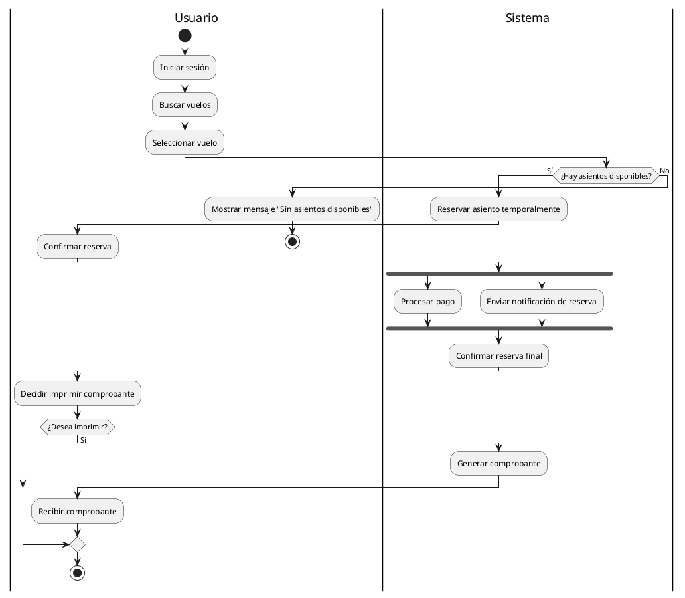

Claro, aquí tienes una propuesta de diagrama de actividades en PlantUML con swimlanes, forks y joins, junto con las asunciones solicitadas. Puedes copiarlo y ajustarlo según lo requieras.

---

### ✅ Asunciones
1. El usuario debe estar autenticado para reservar.
2. El sistema permite reservar solo si hay asientos disponibles.
3. El usuario puede decidir si paga o no la reserva.
4. El pago y la notificación pueden ocurrir en paralelo después de reservar exitosamente.
5. Si no hay asientos, se informa y termina el proceso.

---

### ✅ Diagrama de Actividad PlantUML

---

### ✅ Explicación del diagrama

- **Swimlanes:** Se diferencian claramente las acciones del usuario y del sistema.
- **Fork y join:** 
  - Tras la confirmación de la reserva, el sistema realiza en paralelo el procesamiento del pago y el envío de la notificación.
- **Condiciones:** 
  - Si no hay asientos, el sistema muestra un mensaje y termina.
  - Imprimir comprobante es opcional tras la confirmación.

¿Te gustaría la versión en LaTeX con el código PlantUML embebido y una breve explicación, o necesitas este diagrama en otro formato?
