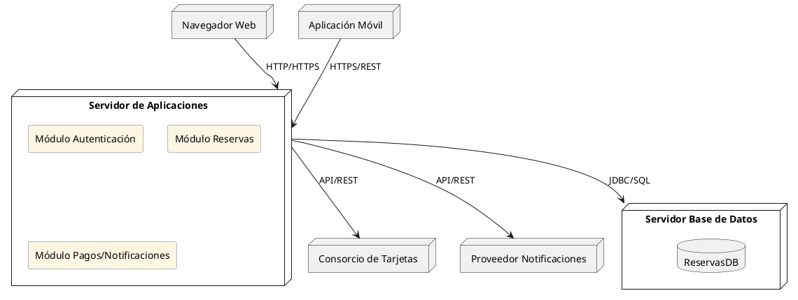

¡Por supuesto! Aquí tienes una guía para el diagrama de despliegue de una **arquitectura de 3 capas** (Presentación, Lógica de Negocio, y Datos) para el sistema de reservación de vuelos, incluyendo asunciones y un ejemplo en PlantUML listo para usar.

---

### ✅ Asunciones

1. **Capa de Presentación:** Los usuarios acceden a través de navegadores web o dispositivos móviles.
2. **Capa de Lógica de Negocio:** Implementada como un servidor de aplicaciones (por ejemplo, Java EE, .NET, Node.js, etc.).
3. **Capa de Datos:** Un servidor de base de datos dedicado gestiona la persistencia.
4. El sistema puede interactuar con servicios externos (Consorcio de Tarjetas y Proveedor de Notificaciones) vía internet.
5. El servidor de aplicaciones y de base de datos están en una red segura interna.

---

### ✅ Componentes por capa

**Capa de Presentación:**
- Navegador Web
- Aplicación Móvil

**Capa de Lógica de Negocio:**
- Servidor Web / Aplicaciones
  - Módulo de Autenticación
  - Módulo de Reservas
  - Módulo de Pagos/Notificaciones

**Capa de Datos:**
- Servidor de Base de Datos (MySQL, PostgreSQL, etc.)

---

### ✅ Diagrama de Despliegue PlantUML

---

### ✅ Explicación del Diagrama

- **Presentación:** Los usuarios interactúan mediante navegador web o app móvil, que se comunican con el servidor de aplicaciones.
- **Lógica de Negocio:** El servidor de aplicaciones contiene los módulos principales y se encarga de la lógica y las reglas de negocio.
- **Datos:** El servidor de base de datos almacena toda la información del sistema.
- **Servicios Externos:** El servidor de aplicaciones se comunica con servicios externos para pagos y notificaciones.

---

¿Quieres incluir este diagrama como imagen en tu documento LaTeX o necesitas la explicación formal para tu informe?
