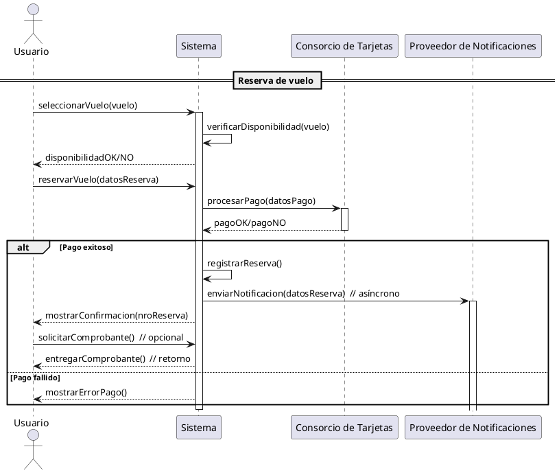

¡Por supuesto! Vamos a construir el diagrama de secuencia para el escenario “Reserva exitosa de vuelo”, usando mensajes síncronos, asíncronos y de retorno.

---

### ✅ Asunciones

1. El usuario ha iniciado sesión previamente.
2. El usuario selecciona un vuelo y procede a reservar.
3. El sistema contacta al consorcio de tarjetas para procesar el pago (síncrono).
4. El sistema envía la notificación de reserva (asíncrono).
5. El sistema retorna confirmación al usuario.
6. El usuario puede solicitar el comprobante (opcional).

---

### ✅ Participantes

- Usuario
- Sistema
- Consorcio de Tarjetas
- Proveedor de Notificaciones

---

### ✅ PlantUML – Diagrama de Secuencia

---

### ✅ Explicación

- **Mensajes síncronos:**  
  - `Sistema -> Consorcio: procesarPago` espera respuesta antes de continuar.
  - `Usuario -> Sistema: reservarVuelo` espera respuesta.
- **Mensajes asíncronos:**  
  - `Sistema -> Notificaciones ++: enviarNotificacion` se dispara y el sistema continúa sin esperar respuesta inmediata.
- **Mensajes de retorno:**  
  - `Consorcio --> Sistema: pagoOK/pagoNO`  
  - `Sistema --> Usuario: mostrarConfirmacion`  
  - `Sistema --> Usuario: entregarComprobante`

¿Quieres la explicación formal de cada paso o la versión para incluir en LaTeX?
